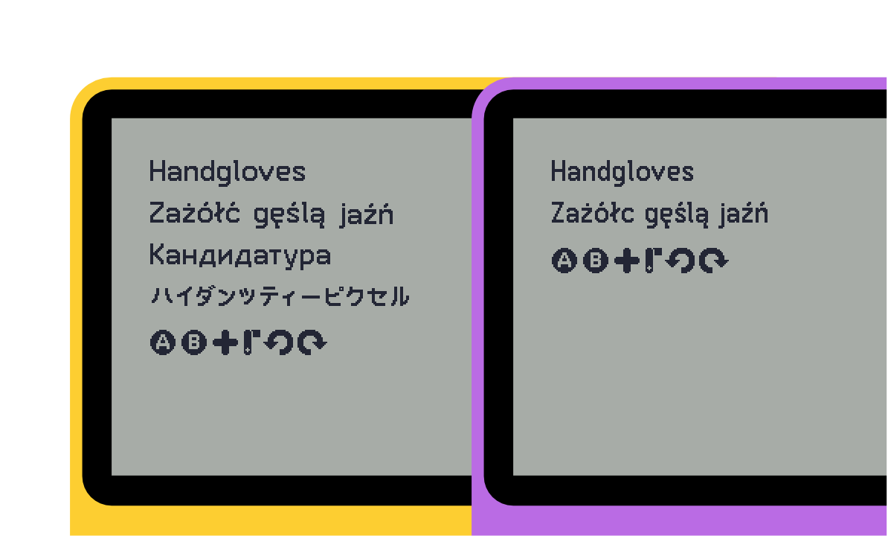

## June

June is a high-resolution bitmap font with some playful curves and distinctive letterforms, inspired by portable game fonts of the 00's.

I made it to use in my own game concepts for the [Panic Playdate](https://play.date), as I didn't really find fonts that suited the size needs of the display or the kind of aesthetic I wanted. 

It's also probably applicable to other situations involving high-density, low colour depth displays.

It's currently in a prototype stage, I'd like to get it encoded in a format or two very soon.

---

### Aspects

- Full European Latin support, Japanese Kana support.
- On a Playdate screen, it's estimated to be about 14px/~1.8mm baseline to ascender height for Latin, 14px/~1.8mm square height/width for CJK characters. (Essentially the same size as body text on iPhones)
- Borrows visual cues from  monospaced fonts to more clearly distinguish certain similar Latin characters (ie. I/i/1/l).
- Currently, Japanese characters have only been designed/framed to be written in horizontal writing orientation so they can be typed alongside the rest of June's characters in a seamless way, but this might change in the future.

----

### Character areas supported:

- Basic Latin / ASCII (full)
- Latin-1 Supplement (full)
- Latin Extended-A (full)
	- (excluding the depreciated U+0149 character)
- Hiragana (full)
- Katakana (full)

##### In progress character areas (june_wip.ase)
- Japanese Punctuation
- Full-Width Latin (most)
- Full-Width Latin Punctuation (some)
- Playdate input icons in two sizes (one to fit Latin characters better, the other to fit CJK characters, I'll probably revise this in the future)

---

### Todo:

- Finish Japanese punctuation and Full-Width Latin
- Get the font encoded into a format or two
- Declare kerning pairs
- Add € and some other useful signs not covered by the blocks I've done so far
- Give all the characters a thorough testing
- Do some other symbols (smileys, hearts, etc.)
- Consider supporting a segment of the most used and least complex Kanji

---

### License

This font is licensed under the [zlib license](license.txt) (it's basically like MIT).

---

### Special thanks

- kiilas for checking over the Central European accented characters for me.
- Someone on Mastodon for figuring out [what display the Playdate uses](https://www.sharpsma.com/products?sharpCategory=Memory%2520LCD&p_p_parallel=0&sharpProductRecordId=1504552), which helped me definitively figure out how big the font would be on a real Playdate.